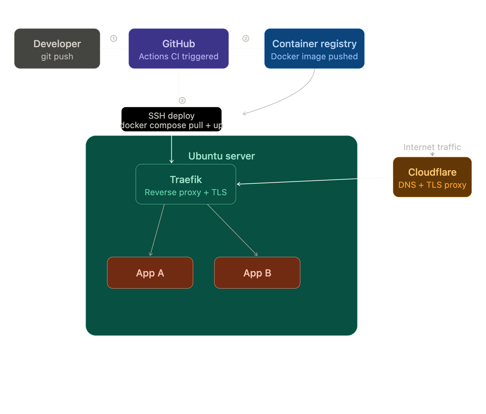

Server `ubuntuserver.rossebo.no`


## Server Setup

```bash
# Install Docker
curl -fsSL https://get.docker.com | sh
sudo usermod -aG docker $USER

# Install Compose plugin
sudo apt install docker-compose-plugin


 
````

